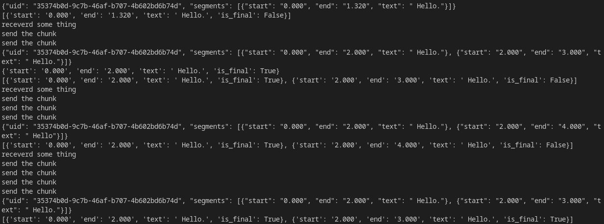

# WhisperLive
This module integrates Facebook's denoising technology with OpenAI's Whisper ASR (Automatic Speech Recognition) system to reduce noise in input audio streams, improving transcription accuracy and reducing hallucinations. The module supports multi-threading and can load various Whisper models, including language-specific models from Hugging Face, making it versatile for different transcription needs. The server-client architecture allows users to leverage Whisper's capabilities in their daily tasks.
Features

- Noise Reduction: Utilizes Facebook's denoising algorithm to clean input audio.
- Whisper Integration: Leverages Whisper's robust ASR capabilities for accurate  transcription.
- Multi-Model Support: Easily load different Whisper models, including language-specific models from Hugging Face.
- Server-Client Architecture: Runs Whisper on a server, with a client program for interfacing.
- Real-Time Processing: Supports real-time audio processing for immediate feedback.
- Multi-Threading: Handles multiple requests simultaneously for efficient processing.
- Hot-word: you can specify the hot word in `hotword` file inside the server folder by which it can focus on particular words accoring to you needs
- Model WarmUP: you can pred load the model in the memory befor you connect to it via websocket, by doing this we can get improvment of 100~200 ms in first response and also decrease the connection init time

  

## Install Instruction
```shell
pip install git+https://github.com/bolna-ai/streaming-whisper-server.git

pip install transformers
```
note: dont worry about version conflict

## Create project
```shell
python3 -m CustomWhisper -c <project name> -dn <True,False (for denoise active or deactive)>
```
project have three folder ASR, NoiseWeights, VAD and two file hotwords and Server.py you have to make sure you put model in ASR folder, the server code automatically detect model from ASR folder so please make sure of that, if client send wrong model name then , first model is selected automatically
### Project Structure

- ASR: Directory for storing Whisper models. Ensure that all models are placed in this folder.
- NoiseWeights: Directory containing the weights for the denoising model.
- VAD: Directory for Voice Activity Detection components.
- hotwords: File for hotword detection configuration.
- Server.py: Main server script that runs the application.
## Add ASR models
```shell
ct2-transformers-converter --model <model: openai/whisper-tiny> --copy_files preprocessor_config.json --output_dir <output_dir: ASR/whisper_tiny_ct> --quantization float16
```
note: add it on ASR folder
## WarmUP
```python
import requests

res = requests.post("http://127.0.0.1:6700/load-model/",json={
    "model-name":"tiny",
    "mode":"auto"
})

print(res.status_code)
model = res.json()["model-id"]
print(model)
```
you have to use model id insted of model name, and you can use pre-loaded model
## Run server

### Normal RUN
```
> cd my-project
> ls
ASR  NoiseWeights hotwords Server.py  VAD
> python3 Server.py -p 9000
```
### With Diffrent denoise
```
> cd my-project
> ls
ASR  NoiseWeights hotwords Server.py  VAD
> python3 Server.py -p 9000 -deno FaceBookDenoiseM64
```
there are three denoiser `FaceBookDenoiseM64,FaceBookDenoise,  DeepFilterNetDenoise`, by default FaceBookDenoise is selected

### Change the WarmUP service PORT 
```
> cd my-project
> ls
ASR  NoiseWeights hotwords Server.py  VAD
> python3 Server.py -p 9000 -pw 7899
```
there is no memory limiter in package , so be careful load up many client parallel load whisper models parallely in memory so be careful
